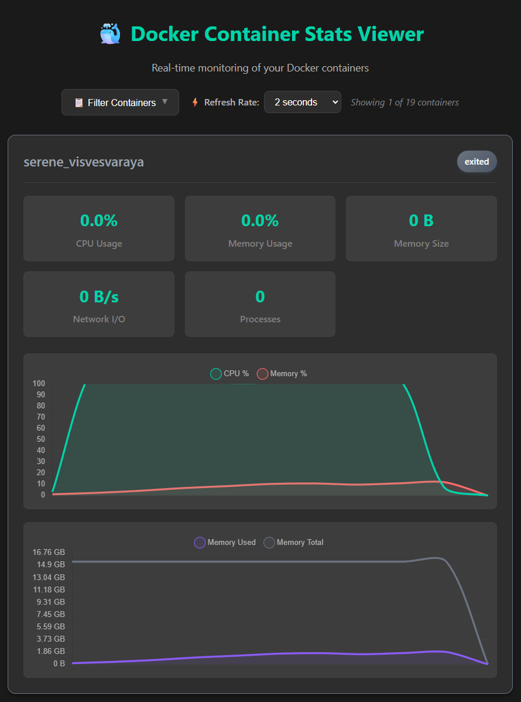

# Docker Container Stats Viewer

A simple web-based tool to visualize Docker container statistics in real-time without requiring Docker Desktop.

Created using Copilot 🤖



## Features

- Real-time monitoring of Docker container statistics
- Interactive charts showing CPU usage, memory usage, and network I/O
- Web-based interface accessible via browser
- Lightweight and self-contained
- Filter and toggle container visibility
- Configurable refresh rates (1s, 2s, 5s, 10s, 30s)
- Automatic detection of new containers
- Support for monitoring both running and stopped containers
- WebSocket-based real-time updates

## Prerequisites

- Node.js
- Docker installed and accessible via command line
- Docker containers (running or stopped)

## Installation

1. Navigate to the docker-viewer directory:
   ```bash
   cd d:\imjs\docker-viewer
   ```

2. Install dependencies:
   ```bash
   npm install
   ```

## Usage

1. Start the application:
   ```bash
   npm start
   ```

   For development with auto-restart:
   ```bash
   npm run dev
   ```

2. Open your browser and navigate to:
   ```
   http://localhost:3000
   ```

3. The application will automatically detect all containers (running and stopped) and display their statistics in real-time charts.

4. Use the filter controls to show/hide specific containers and adjust the refresh rate as needed.

## Features in Detail

### Container Monitoring
- Displays all Docker containers (running, stopped, created, paused)
- Real-time stats for running containers
- Status updates for non-running containers
- Automatic detection of new containers every 5 seconds

### Interactive Controls
- **Filter Containers**: Toggle visibility of individual containers
- **Select All/None**: Bulk container visibility controls
- **Refresh Rate**: Configurable update intervals from 1-30 seconds
- **Real-time Charts**: CPU/Memory percentage and memory usage charts

### Container Information
- Container name and current status
- CPU usage percentage
- Memory usage percentage and absolute values
- Network I/O statistics
- Process count (PIDs)
- Real-time status badges with color coding

## API Endpoints

- `GET /` - Main dashboard
- `GET /api/containers` - Get list of all containers (running and stopped)
- WebSocket `/` - Real-time stats streaming with subscription model

## WebSocket Protocol

The application uses WebSocket for real-time communication:

- **Subscribe**: `{"type": "subscribe", "containerId": "...", "refreshRate": 2000}`
- **Unsubscribe**: `{"type": "unsubscribe", "containerId": "..."}`
- **Stats Response**: `{"type": "stats", "containerId": "...", "data": {...}, "timestamp": ...}`
- **Status Response**: `{"type": "status", "containerId": "...", "status": "...", "timestamp": ...}`

## Development

The project includes:
- **Express.js** backend for serving static files and API endpoints
- **WebSocket** server for real-time communication
- **Chart.js** for interactive data visualization
- **Vanilla JavaScript** frontend with modular architecture

### Project Structure
```
docker-viewer/
├── index.js           # Express server and WebSocket handler
├── package.json       # Dependencies and scripts
├── README.md         # This file
└── public/
    ├── index.html    # Main HTML page
    ├── app.js        # Frontend JavaScript application
    └── styles.css    # CSS styling
```

## Stopping the Application

Press `Ctrl+C` in the terminal to stop the server.

## Troubleshooting

- Ensure Docker is running and accessible via command line
- Check that containers exist with `docker ps -a`
- Verify Node.js version with `node --version` (should be v14+)
- Check browser console for WebSocket connection errors
